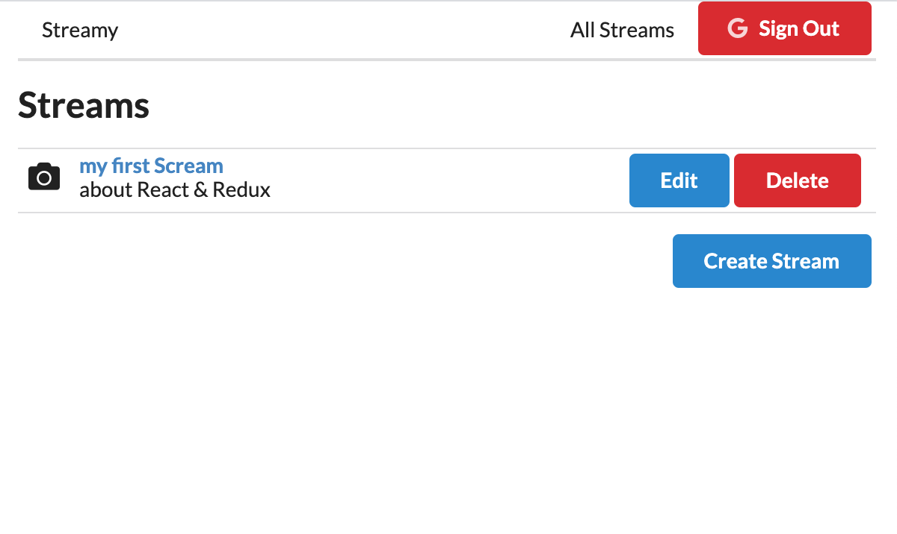
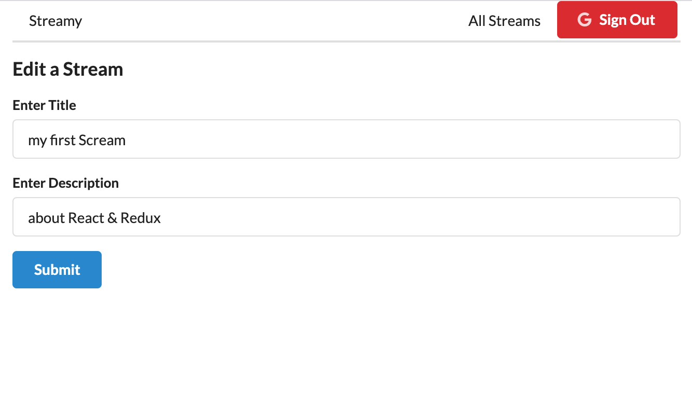
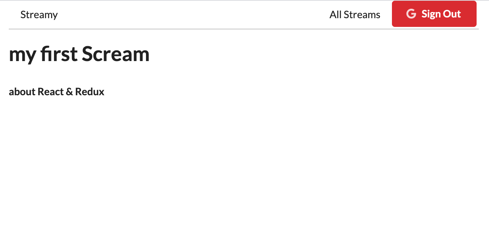

# streams
react-redux video stream application; Router, Authentication,  Handling Forms with Redux Form, Json Server, REST, Modals

* clone this repo

client and api folders, in both folders simultaneously ->

    * `npm install` for dependencies
    * `npm start` to fire up dev server

   list all of them

   create

   update

   delete

   show one of them

